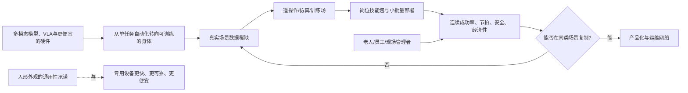

# 具身智能：面向中国产品研究的探索（截至 2026-07-20）

## 边界与读法

这里的“具身智能”指能感知物理环境、作出决策并执行动作的智能系统；人形机器人是其中一种载体，不等同于全部。判断场景以中国为主，着重 2023—2026 年的变化；全球材料仅用于检验中国的路径是否具有普遍性。本文把**已观察到的事实**、**解释**和**待验证机会**分开。公开的中国项目数据多来自政策文件、企业或产业报道，不能将其直接理解为独立审计后的规模化 ROI。

## 研究中的问题地图

这个图中最重要的张力不是“大脑够不够聪明”，而是：每一次真实部署既是交付，也是在付费采集异常数据；而用户需要的是当下可预期的作业结果，不能为模型学习承担不透明的停机、安全或隐私成本。

## 近几年发生的关键变化

### 1. 技术叙事从“运动本体”变成“视觉—语言—动作 + 数据闭环”

**事实。** 2023 年 RT-2 将网络视觉/语言知识与机器人动作共同训练，展示了对新物体和未见指令的更强泛化；Open X-Embodiment 随后把 22 类机器人、527 项技能的数据汇集起来，报告跨本体的正迁移。[RT-2 论文](https://arxiv.org/abs/2307.15818) [Open X-Embodiment 论文](https://arxiv.org/abs/2310.08864) 中国在 2025—2026 年将这一瓶颈制度化：国家数据局明确真机数据采集成本高、优质数据稀缺；工信部与国资委的实景实训行动要求在真实场景积累真机数据、处理异常工况，并评估作业成功率、效率、安全可靠性和经济可行性。[国家数据局案例](https://www.nda.gov.cn/sjj/ywpd/szkjyjcss/1031/20251031193216150911981_pc.html) [实景实训通知](https://www.miit.gov.cn/jgsj/kjs/wjfb/art/2026/art_cd666691abf8471fb8553d463aa416e3.html)

**解释。** 产品竞争的单位正在从“卖一台能做动作的机器人”变成“取得某岗位长期数据、把异常处置变为可复用技能、并持续发布可靠版本”的闭环。模型进步提高了“能学会”的上限，但并未消除物理接触、时延、耐久和边界工况的问题。

### 2. 中国从产业倡议进入“真实岗位验证”的政策和供给阶段

**事实。** 工信部 2023 年的人形机器人指导意见把关键部件、整机、操作系统和应用生态列为短板；2025 年具身智能首次写入政府工作报告（中央网信办的回顾）。2026 年的专项行动则将目标具体化为真实生产生活环境的常态部署、超过 100 个高价值场景和万台级落地能力，并要求用户单位给出验收指标。其示例不是泛泛的“进厂”，而是电池测试线的高压插接：识别准确率、±0.5 mm 精度、15 秒节拍、99% 成功率等。[2023 指导意见](https://www.miit.gov.cn/jgsj/kjs/gzdt/art/2023/art_6144679b0ee54276b594d65435f29d30.html) [政策回顾](https://www.cac.gov.cn/2025-09/18/c_1759916098343469.htm) [专项行动及示例](https://www.ncsti.gov.cn/kjdt/tzgg/202606/t20260609_249248.html)

**解释。** 这标志着评价口径从发布会能力、出货和订单，转向岗位的成功率/节拍/安全/经济性；同时也说明这些指标尚未被普遍满足，否则不需要国家级的“实训—验证—常态部署”机制。

### 3. 中国的比较优势不只是“造本体”，而是密集制造场景与成熟自动化底盘

**事实。** IFR 统计显示，中国 2024 年占全球工业机器人部署的 54%，是最大市场；这意味着大量可观察的工位、系统集成商和改造经验已经存在。[IFR 2025](https://ifr.org/news/global-robot-demand-in-factories-doubles-over-10-years/1) 国内已有工厂实训的公开信号：优必选称其 Walker 在极氪工厂完成连续 21 天搬运，并在比亚迪、富士康等场所验证不同工序；这些是供应商/报道口径，尚缺独立的对照成本和长期故障率。[工厂实训报道](https://cpc.people.com.cn/n1/2025/0423/c64387-40466136.html)

**解释。** 中国最可能先跑出的不是“家庭全能助手”，而是能接入现有产线、替代高风险/高负荷且传统自动化不易覆盖的窄岗位。优势也可能变成反证：既然已有成熟的机械臂、AMR 和专机，新增的人形方案必须证明它减少的是改线、换型或异常处理成本，而非只展示更多通用动作。

### 4. 形态正在分化，产品重点从“像人”转向“与环境和系统兼容”

**事实。** 中国实训政策同时覆盖人形、四足及其他形态，要求按场景选择；北京一款人形产品的发布也把开放接口、主流通信中间件和端云协议兼容作为卖点。[实训通知](https://www.miit.gov.cn/jgsj/kjs/wjfb/art/2026/art_cd666691abf8471fb8553d463aa416e3.html) [产品/平台信息](https://www.ncsti.gov.cn/kjdt/scyq/bjjjjskfq/jkdt/202602/t20260212_238199.html) 全球对照尤其重要：Amazon 在 2025 年已部署第 100 万台运营机器人，说明规模价值可以来自非人形的系统级自动化；它又在 2026 年停止使用 Blue Jay，说明原型或阶段性上线不等于产品—场景匹配成立。[Amazon](https://www.aboutamazon.com/news/operations/amazon-million-robots-ai-foundation-model) [Blue Jay 更新](https://www.aboutamazon.com/news/operations/new-robots-amazon-fulfillment-agentic-ai)

**解释。** “类人”是面对已为人设计的楼梯、工具和工位的潜在兼容策略，不应成为产品需求本身。近期更值得关注的是轮式双臂、固定臂加视觉、四足巡检与人形之间按任务分工，及其共同的调度、数据和安全层。

### 5. 真实落地已有正面信号，但仍多是受控、重复的第一批任务

**事实。** BMW 报告 Figure 02 在其美国工厂十个月内协助生产逾 3 万辆车、搬运逾 9 万件部件；同时该项目暴露了额外隔离、防护和 5G 覆盖的改造需求。GXO 与 Agility 的多年度 RaaS 合同也来自先前的仓储试点。[BMW 复盘](https://www.bmwgroup.com/en/news/general/2026/humanoid-robot-in-leipzig.html) [GXO/Agility](https://www.agilityrobotics.com/content/gxo-signs-industry-first-multi-year-agreement-with-agility-robotics)

**解释。** 正面案例支持“在定义清晰、可隔离、重复且体力负担高的工序，人形/移动操作机器人可以形成价值”。但它们也反对“通用替人”的外推：成功来自任务收窄和现场重构，并非机器人无改造地进入任意环境。

## 使用中的矛盾：按实际用户而非按行业宣传拆解

| 用户/购买者 | 想获得什么 | 真实摩擦与矛盾 | 目前最缺的证据 |
|---|---|---|---|
| 工厂负责人、集成商 | 柔性换型、危险工序替代、少改线 | 需要通用性，却要产线级确定性；本体越通用，接口、围栏、网络、维护和异常兜底越多。政策要求的成功率/节拍/经济性验收正反映了这个缺口。 | 以“同一工位的专机/人工/不同形态机器人”为基准的全生命周期成本、有效作业时长、人工接管率。 |
| 一线员工、班组长 | 减少搬重物、高压或危险暴露 | 机器人可能改善健康和安全，也可能把工作变为监控、复位和为机器让路；一旦行为不可预测，员工不会把它当协作者。中国劳动力数据研究发现工业机器人与工人健康的关系存在群体异质性，不能用平均效应替代岗位设计。 | 部署前后按岗位、班次和资历分层的受伤/负荷、技能迁移、接管负担、留任意愿。 |
| 养老机构、家庭照护者、老人 | 夜间看护、转运、提醒、康复与减轻照护缺口 | 最有需求的人往往也是容错空间最小的人；“陪伴”承诺与尊严、隐私、责任归属冲突。中国已启动 2025—2027 年养老服务机器人试点，明确把安全、可靠、易用列为待攻关短板。 | 真正使用（不是意向）的留存、告警准确性、照护者节省时间、跌倒/误操作、数据授权与退出率。 |
| 商场/展厅/公共空间经营者与访客 | 引流、导览、可见的科技形象 | 表演和互动容易产生瞬时价值，但不自动转为高频服务价值；拥挤、嘈杂、无固定货架等情境让导航、理解、隐私和责任同时变难。上海实训空间已有类似“市集导购”的非预设环境测试。 | 从“围观/曝光”到咨询转化、复访、人工替代时间、故障恢复和投诉的漏斗。 |

养老不宜被当作近期收入的当然答案。上海一项 2024—2025 年的横截面研究考察的是潜在用户意愿而非实际使用，且特别提出中国尚缺专门保护老年机器人使用隐私的法规；另一项与中国退休者的焦点小组发现，健康老人与陪伴机器人的现有价值主张并不匹配。[上海意愿研究](https://pmc.ncbi.nlm.nih.gov/articles/PMC13070475/) [退休者焦点小组](https://arxiv.org/abs/2410.12205) 这些都不是“老人不接受”的结论，而是提醒不要把人口老龄化直接换算成购买需求。

## 不太显然、但值得继续验证的产品机会

以下是机会假设，不是投资或产品建议。每项都列出最强替代解释和一个低成本分辨测试，避免把它们写成既定趋势。

### A. 把“岗位验收与异常闭环”做成硬件无关的产品层

**假设。** 当前最稀缺的可能不是又一台人形机，而是把一个工位拆成可测量任务、异常标签、接管流程、回归测试和版本验收的工具链/服务。它能同时服务人形、轮式双臂和既有自动化；若成立，会比整机形态更早积累跨客户的复用资产。

**为什么不显然。** 行业注意力集中在本体、灵巧手和大模型；但 2026 政策已经要求用户单位自行定义测试规程和达标条件，说明“验什么、失败后怎么办”还是空白层。[专项行动](https://www.miit.gov.cn/jgsj/kjs/wjfb/art/2026/art_cd666691abf8471fb8553d463aa416e3.html)

**最强替代解释。** 每个客户工艺和数据权属都高度定制，无法形成平台。  
**最小验证。** 找同一行业两座相近工厂，对一个“高频但异常多”的工位做 4 周旁路运行：记录每次尝试、接管原因、恢复时间和版本变化。若第二家仅需复用少量标签/规则即可完成验收框架，而非从零咨询，平台假设才成立。

### B. 从“采集更多动作”转向“最有价值的失败数据”数据运营

**假设。** 早期客户愿意付费的并非通用数据集，而是针对其长尾异常（错位、遮挡、物料差异、网络中断、人员穿行）的采集、合成、重放和安全回归服务；这会把数据采集从研发成本转为可管理的现场产品。

**为什么不显然。** 真机数据稀缺的通常叙事是规模不足；但实际部署失败往往集中在少数边界状态。政策也明确要求记录异常处置、突发干扰和边界工况，而不仅是成功轨迹。[实训通知](https://www.miit.gov.cn/jgsj/kjs/wjfb/art/2026/art_cd666691abf8471fb8553d463aa416e3.html)

**最强替代解释。** 只要扩大演示量，基础模型自然会覆盖异常。  
**最小验证。** 对 3 个已运行工位先做失效 Pareto 图；把下一周采集预算的一半投入最常见两类失败，另一半随机采样。比较下一版在真实回放和现场的失败下降幅度。若定向数据显著更有效，机会更成立。

### C. 将“人机协作可预期性”当作核心 UX，而非合规附属品

**假设。** 对现场采用速度影响更大的，可能是可见状态、意图提示、可授权的接管、事件回放和班组级培训，而不只是峰值动作能力。产品可定位为机器人车队的“协作界面/安全运营层”。

**依据与边界。** BMW 的成功试点仍需调整隔离和网络；人机协作研究也显示可用性和信任与员工未来使用意愿有关，但这类证据不能直接推出中国一线员工的购买行为。[BMW](https://www.bmwgroup.com/en/news/general/2026/humanoid-robot-in-leipzig.html) [工作场景的信任研究](https://pmc.ncbi.nlm.nih.gov/articles/PMC9165858/)

**最强替代解释。** 只要可靠性提升，解释界面便没有价值。  
**最小验证。** 在同一机器人任务中做 A/B：仅提高成功率的后台版本，对比成功率相同但增加“下一步意图、风险区、可一键接管、班后回放”的版本；测量旁观者安全感、非必要急停、接管恢复时间和主管允许扩围的意愿。

### D. 养老的近期切口是“照护团队的闭环节点”，不是拟人陪伴承诺

**假设。** 最早可持续的养老产品，可能是固定时段/地点的低风险任务（物资递送、环境巡检、康复提醒、呼叫分流、远程家属协作）及其与护理记录、人工响应的交接，而不是承担情感关系或独立照护。

**为什么不显然。** 市场容易用人口结构和拟人互动推导“陪伴机器人”；真实研究却显示隐私、能力信任、基础设施衔接和价值差异会决定接受度，且意向与长期使用之间有距离。[潜在用户研究](https://pmc.ncbi.nlm.nih.gov/articles/PMC13070475/) [焦点小组](https://arxiv.org/abs/2410.12205)

**最强替代解释。** 老人真正需要的是情感陪伴，工作流型设备没有支付意愿。  
**最小验证。** 选择一个护理单元，仅上线一个可人工兜底的闭环任务 6 周；同时向老人、家属、护士分别测量完成率、人工节省时间、被打扰感、授权/撤回数据的比例和续用意愿。若护理流程收益显著而老人不愿单独互动，说明购买者与使用者价值应被分开设计。

### E. “形态选择器”与改造决策服务：先证明何时不该用人形

**假设。** 面向制造与物流的产品机会可以是任务—环境—成本的决策工具：把固定臂、AMR、轮式双臂、人形及人工排入同一基线，输出最小环境改造、预期接管和验收计划。它既能降低客户试错，也让真正需要双足/人形兼容的任务更清晰。

**为什么不显然。** 它看似削弱人形销量，实际可能建立客户信任并筛出高价值工位；中国大量工业机器人存量使这种“与既有系统共存”的问题尤其现实。[IFR](https://ifr.org/news/global-robot-demand-in-factories-doubles-over-10-years/1)

**最强替代解释。** 客户会直接由集成商做方案，独立比较没有价值。  
**最小验证。** 对 10 个待自动化工位做盲评：专家组与工具各给出形态/改造建议；比较建议一致度、预算偏差和客户是否愿意为试点设计付费。若工具只复制既有咨询，停止；若能系统性排除不适合人形的项目，则有价值。

## 应继续追踪、而非现在下结论的指标

- **有效作业小时**：不是出货量或演示次数，而是完成合格任务的小时数，以及故障、充电、人工接管占比。
- **跨站点复制成本**：第二个相似工位需要多少环境改造、重新采集、远程支持和安全审查；这是“通用性”最诚实的代理指标。
- **与替代方案的全成本**：将改线、围栏/网络、培训、维护、停机、保险和人工兜底纳入，而不是只比采购价或人力工资。
- **异常覆盖与回归**：每个模型/技能版本对历史异常的通过率，及新增失败是否可被复现、归因和修复。
- **多角色采用**：购买者、操作员、受服务者、家属/监管者的价值不应混成单一“满意度”。
- **安全、隐私和责任边界**：传感数据流向、离线能力、紧急制动、事件黑匣子、数据撤回和责任归属是否在部署前可解释、可审计。

## 仍未解决的反例与不确定性

1. 公开“订单、进厂、量产”并不等于机器人独立完成了多少合格工时；中国尚少可交叉验证的长期运行、事故和 ROI 数据。因此不能据此判断市场已规模化。
2. 具身基础模型可能显著降低适配成本，也可能受制于真机数据、接触物理和安全验证而长期呈现“每个客户一套”。前者会提高通用平台价值，后者会让垂直集成与服务更重要。
3. 工厂可能是首发场景，却未必是人形的最大市场：工业环境越标准化，专用机器人越有优势；人形的价值应在改造昂贵、空间为人设计、任务频繁变化的交集里验证。
4. 养老需求真实但不自动构成机器人需求。试点应把“减轻照护者负担”和“让被照护者愿意接受”分别量化，并保留人工退出与责任兜底。

## 来源与证据强度说明

- **一手政策/公共机构**：工信部 2023 指导意见、2026 实景实训行动；国家数据局具身数据集案例；IFR 工业机器人统计；工信部/民政部养老机器人试点。[养老试点](https://www.miit.gov.cn/jgsj/zbys/wjfb/art/2025/art_577966ee40fb4d748ce7e5acecc0587f.html)
- **一手运营方**：BMW、Amazon、GXO/Agility 的部署材料，适合说明其项目和条件，但对效果仍应当作运营方陈述，而非独立审计。
- **学术研究**：RT-2、Open X-Embodiment 用于技术范式；上海老年人研究与退休者焦点小组用于理解态度和需求边界，不能外推为全国实际购买率。
- **未采用为关键结论的材料**：单一厂商的订单、出货、效率宣传和市场规模预测，因缺少统一口径与独立核验，仅作为“存在试点/供给热度”的弱信号。

